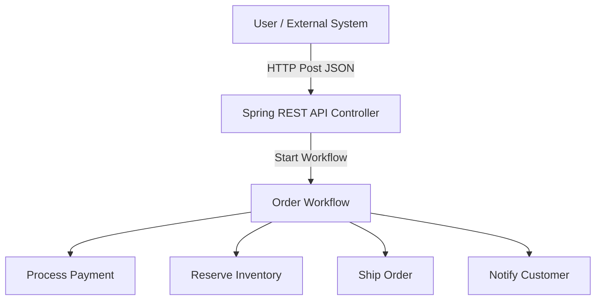
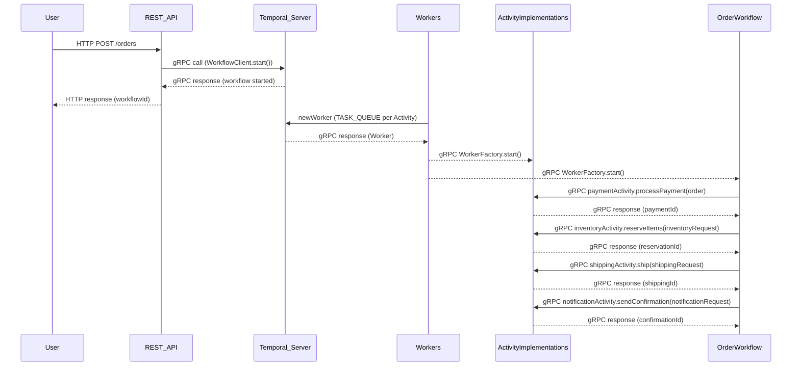
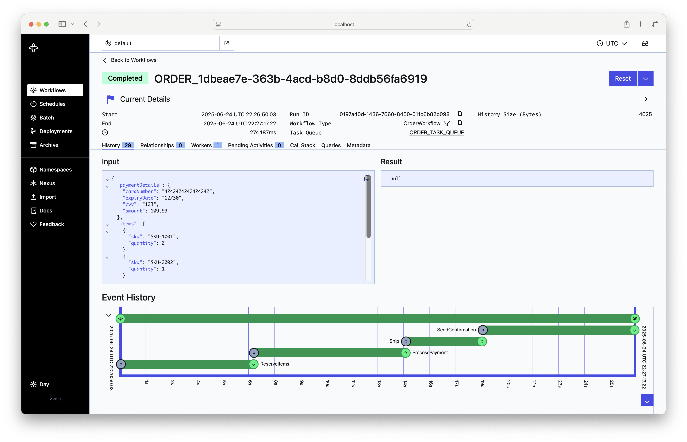

# Order Workflow Services with Temporal

This repository demonstrates a **services-based e-commerce order workflow** using [Temporal](https://temporal.io/), structured as a multi-module Java project. 

Each step has it's own worker, task queue and activity implementation. 

## Key Features

- **Orchestrated Order Workflow** — Java Temporal workflow for end-to-end order processing
- **Separation of Concerns** — Four separate activity workers (payment, inventory, shipping, notification), each as an independent service
- **Spring Boot REST API** — To initiate order workflows over HTTP

### Pros of Separate Workers/Queues per Workflow Step

1. **Strong Isolation**
   Each activity type is isolated so errors, bugs, or scaling issues in one do not impact others.
   Operational blast radius is smaller (e.g., a bug in shipping does not bring down payment or inventory processing).
2. **Independent Scaling**
   You can horizontally scale (add replicas) only the bottlenecked step.
   Example: If inventory checks are slow, just scale up inventory workers.
3. **Fine-Grained Resource Allocation**
   Assign more CPU/memory/network to high-demand or heavy-weight steps (e.g., payment processing).
4. **Independent Deployments**
   Release and upgrade each activity service independently.
   Faster hotfixes, safer rollbacks.
5. **Fault and Security Isolation**
   Compromise or crash in one worker service doesn’t expose the others.
   Different security policies or network boundaries per activity.
   
### Cons of Separate Workers/Queues per Workflow Step

1. **Increased Operational Complexity**
   More services to deploy, monitor, configure, and manage.
   More moving parts in CI/CD, more containers or processes to monitor.
2. **Queue Management Overhead**
   Must keep track of multiple task queues—naming, configuration, and assignment must be consistent.
3. **Potential for Orphaned Work**
   If a worker for a step is accidentally not running, tasks will queue up in Temporal, possibly unnoticed unless alerting is set up per queue.
4. **Harder Local Development/Testing**
   Local dev requires running multiple services instead of one.
   Integration testing is more involved.
5. **Slightly Increased Latency**
   More network hops, potentially more context switching if using different machines/nodes.

---

## Architecture Overview

### Modules

- `order-workflow-commons`
  - Common data classes (`Order`, `Item`, `PaymentDetails` etc)
  - Activity interfaces (`Payment`, `Inventory`, `Shipping`, `Notification`)
  - Task queues — a separate task queue for each activity/worker
- `order-workflow`
  - Workflow interfaces and workflow implementation
  - Order worker
- `payment-worker` — Payment activity implementation and worker main class
- `inventory-worker` — Inventory activity implementation and worker main class
- `shipping-worker` — Shipping activity implementation and worker main class
- `notification-worker` — Notification activity implementation and worker main class
- `order-api` — Spring Boot REST API to start workflows

---

### High Level System Architecture



### Simple Sequence
**Note**: for each step there is a workflow and activity implementation and the sequence happens for all worker/activities


## Building and Running Order Workflow

### Prerequisites

- Java 21
- Maven 3.8+
- multiple terminal windows (one for each worker to start)

### Steps to run...
1. From a new terminal window, launch the Temporal server
```
temporal server start-dev \
    --log-level=never \
    --ui-port 8888 \
    --db-filename=temporal.db
```

From the `temporal-order-workflow` directory
2. Clean, build, package and install into local .m2 repository
```
mvn clean install
```
3. Launch the order api Springboot REST app, from a new terminal window...
```
cd order-api
mvn spring-boot:run
```
  - The server will be listening on port 8080

4. Launch the Order workflow worker, from a new terminal window, navigate to the `temporal-order-workflow` directory...
```
cd order-workflow
mvn exec:java -Dexec.mainClass="com.dr.sandbox.temporal.workflow.OrderWorker"
```
5. Launch the Payment worker, from a new terminal window, navigate to the `temporal-order-workflow` directory...
```
cd payment-worker
mvn exec:java -Dexec.mainClass="com.dr.sandbox.temporal.activityimpl.PaymentWorker"
```
6. Launch the Inventory worker, from a new terminal window, navigate to the `temporal-order-workflow` directory...
```
cd inventory-worker
mvn exec:java -Dexec.mainClass="com.dr.sandbox.temporal.activityimpl.InventoryWorker"
```
7. Launch the Shipping worker, from a new terminal window, navigate to the `temporal-order-workflow` directory...
```
cd shipping-worker
mvn exec:java -Dexec.mainClass="com.dr.sandbox.temporal.activityimpl.ShippingWorker"
```
8. Launch the Notification worker, from a new terminal window, navigate to the `temporal-order-workflow` directory...
```
cd notification-worker
mvn exec:java -Dexec.mainClass="com.dr.sandbox.temporal.activityimpl.NotificationWorker"
```

You will have 7 separate terminal windows.... this will allow you to watch the logs when the workflow is executing

### Run the workflow: Creating an Order

```
curl -X POST http://localhost:8080/orders \
  -H "Content-Type: application/json" \
  -d '{
    "customerId": "customer-123",
    "shippingAddress": {
      "street": "123 Main Street",
      "city": "Denver",
      "state": "CO",
      "postalCode": "80203",
      "country": "USA"
    },
    "paymentDetails": {
      "cardNumber": "4242424242424242",
      "expiryDate": "12/30",
      "cvv": "123",
      "amount": 109.99
    },
    "items": [
      { "sku": "SKU-1001", "quantity": 2 },
      { "sku": "SKU-2002", "quantity": 1 }
    ]
  }'
```

**Sample response:**

```
ORDER_1dbeae7e-363b-4acd-b8d0-8ddb56fa6919
```

**To view the workflow running**
- Navigate to [http:localhost:8888](http:localhost:8888)
- Select the workflow running
  - each step will randomly take between 2-10sec
- The completed flow should looking something like:



### Demonstrating aynchronous interactions

#### Get the status of a workflow (using a workflow query method)
```
curl -X GET "http://localhost:8080/orders/status/[wofklowId]"
```

#### "Soft" Cancel the workflow: Cancel an Order (using a workflow signal method)
Every 3rd request will kick off a "human in the loop" simulation in the reserve inventory
request. That will create a pause for 60sec for simulation purposes. Once you are in the that
human in the loop simulation, use the curl command below to cancel the workflow.

```
curl -X POST \
  -H "Content-Type: application/json" \
  -d '{"workflowId": "workflowId' \
  http://localhost:8080/orders/cancel
```

### "Retry of Payment processing step in the Order Workflow"

`DEFAULT_RETRY_OPTIONS` are defined in the Order Workflow implementation. They are:

- `initialInterval`	Wait 2s before first retry
- `backoffCoefficient`	Wait doubles each time: 5s, 10s, 15s etc
- `maximumAttempts`	Retry up to 3 times total
- `maximumInterval`	Cap retry delay at 10s

To flex the retry options, start a 4th workflow (remember the 3rd workflow will 
simulate a human in the loop for the inventory request) and then request 4 in the
payment activity will throw a simulated exception forcing the retries to execute. On the
3rd retry attempt (request 6 in the Payment Worker logs) the payment will succeed. Navigating
in the UI to the workflow you will see the retry attempts.

### Future work

- Add tests
- ~~Add an async interaction~~
- Deploy into k8s cluster to allow for easy worker scaling
- Run JMeter (or equivalent) to stress the system with lots of orders 
- Implement Saga pattern to do compensating steps for errors in steps of the workflow
- Implment a claim-ticket pattern for passing workflow data
- Deploy temporal to k8s cluster and setup a database and ELK stack for central logging