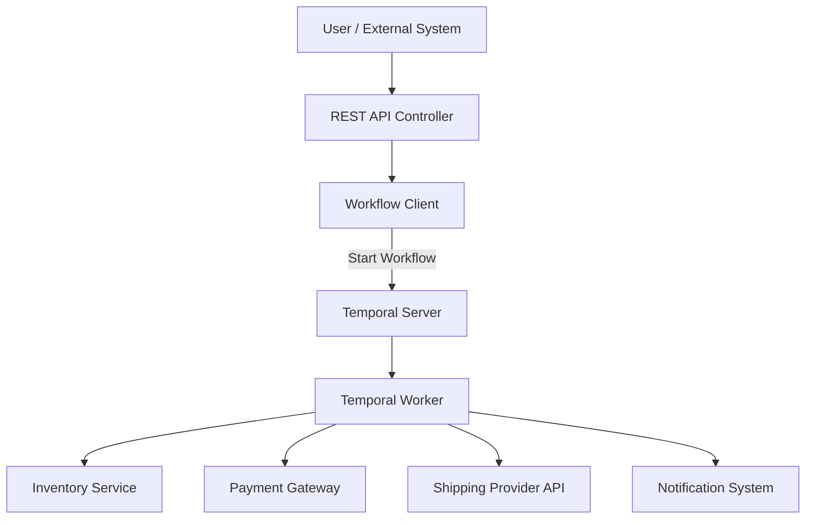

# Order Workflow Services with Temporal

This repository demonstrates a **services-based e-commerce order workflow** using [Temporal](https://temporal.io/), structured as a multi-module Java project.

## Key Features

- **Orchestrated Order Workflow** — Java Temporal workflow for end-to-end order processing
- **Separation of Concerns** — Four separate activity workers (payment, inventory, shipping, notification), each as an independent service
- **Spring Boot REST API** — To initiate order workflows over HTTP

---

## Architecture Overview

### Modules

- `shared-models` — Common data classes (`Order`, `Item`, `PaymentDetails`)
- `order-workflow` — Workflow and activity interfaces and workflow implementation (no worker logic)
- `payment-worker` — Payment activity implementation and worker main class
- `inventory-worker` — Inventory activity implementation and worker main class
- `shipping-worker` — Shipping activity implementation and worker main class
- `notification-worker` — Notification activity implementation and worker main class
- `order-api` — Spring Boot REST API to start workflows

---

### High Level System Architecture

